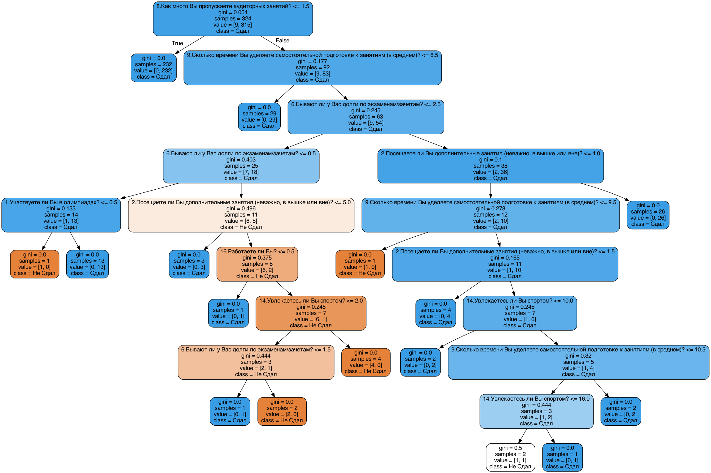
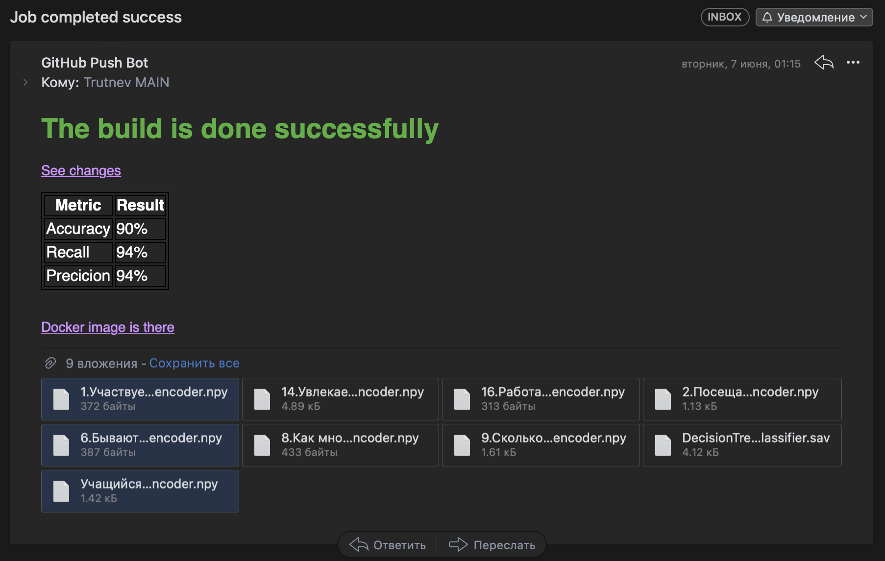

# Machine Learning in Education Quality Problem

## The idea

Use DesicionTreeClassifier model for detecting unsuccessful students by their non-studying activity.

```
Input: 
The dataset of 465 HSE students
```

**The Model Graph**


## The result

You may download last version of algoritm

`docker pull alexgiving/simplewhale:latest`

## Plans
The algorithm must get only special type of answers so it would be better to make an questionnaire interface page on localhost.

## CI pipeline


The last step send info about commit with model and hash files

